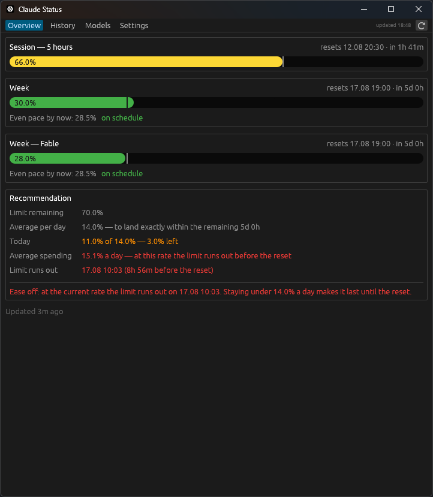
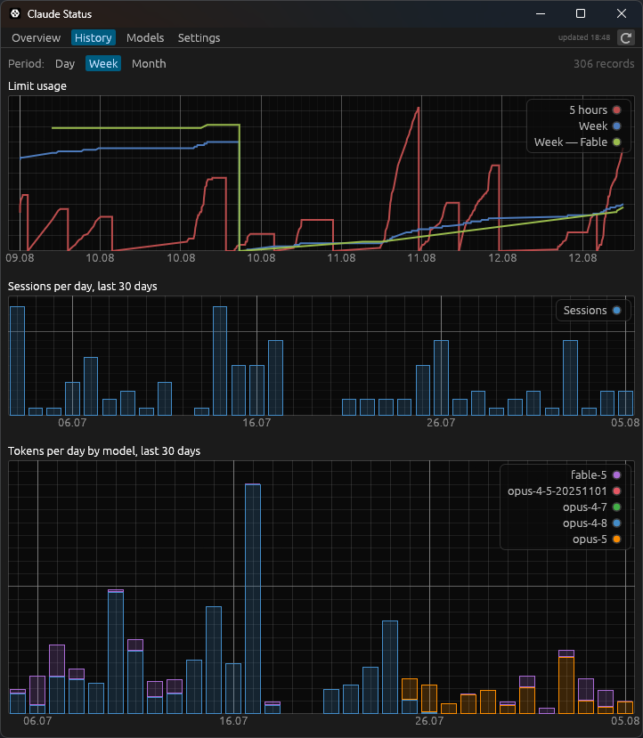
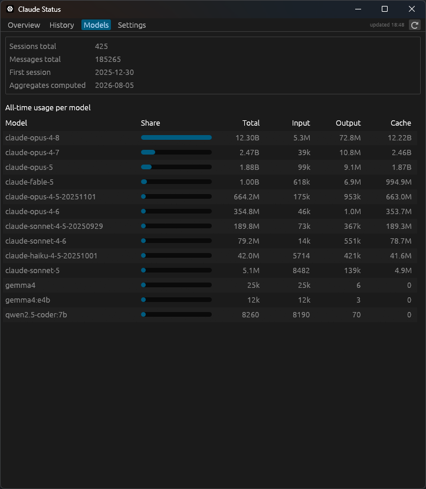
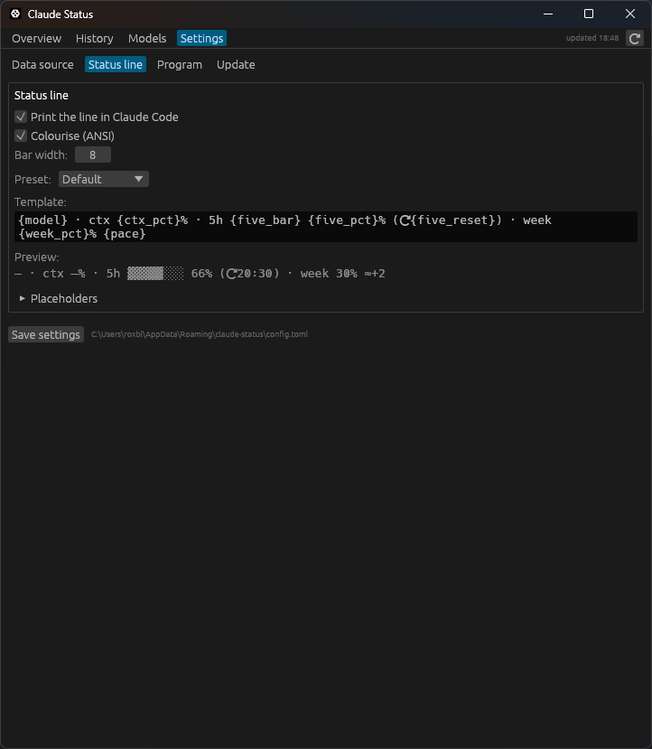

# claude-status

[](https://github.com/roxblnfk/claude-status/actions/workflows/ci.yml)
[](https://github.com/roxblnfk/action-vibe-index)
[](README.ru.md)

Claude Code says nothing about how fast you are spending your subscription
limits until one of them stops you. This watches them.

A tray icon with two rings — the five-hour session on the outside, today's share
of the weekly budget inside — a window with the history, and, if you want one, a
line in Claude Code's own status bar. The part worth having is the advice: it
works out how much may still go today to land exactly on the weekly reset,
rather than running dry on Thursday.

| Overview | History |
|:--:|:--:|
|  |  |
| **Models** | **Settings** |
|  |  |

## Install

Take the archive for your platform from the
[releases](https://github.com/roxblnfk/claude-status/releases), unpack it
anywhere, run `claude-status`, and press **Register in Claude Code** under
**Settings → Data source**. Restart your Claude Code sessions afterwards.

Registration edits one key in `~/.claude/settings.json`, keeping a backup and
leaving a third-party status line alone unless told to replace it.

On Linux the tray icon needs system libraries:

```bash
sudo apt install libgtk-3-dev libayatana-appindicator3-dev libxdo-dev
```

## Good to know

The status line only reaches Claude Code started from a terminal; a session
hosted by an editor draws none. When it goes quiet, the limits are asked for
directly instead — which starts a short-lived Claude Code of its own, no more
often than every 15 minutes. Both the interval and the whole thing can be turned
off under **Settings → Data source**.

Where the tokens went — by model, by project, and how much of it subagents
spent — is counted from the session logs Claude Code writes: once a day by
itself, on the button under **Settings → Data source**, or with `claude-status
scan`. Only whole messages are counted, so a resumed session cannot inflate the
total by repeating the history it continues.

The period is picked on the History and Models tabs and stepped through with
the arrows: last week, the month before last, or all of it, the same way.

`opus`, `sonnet` and `haiku` are aliases, and Claude Code decides for itself
which release each one means — a new one arrives and your sessions move onto it.
**Settings → Models** points an alias at a particular release, so that
`/model opus` keeps working and lands where you left it. It also sets the model a
session starts on and the one subagents run on. Which models your plan may run is
known only to Claude Code, so nothing there is verified — a name it does not
accept shows up as a session that refuses to start.

The status line template is edited in the window, with a live preview, ready
presets and the list of placeholders.

Settings, the database and its backups live in `%APPDATA%\claude-status` on
Windows, `~/.local/share/claude-status` on Linux and `~/Library/Application
Support/claude-status` on macOS. `CLAUDE_STATUS_DIR` overrides it.

The interface follows the system language, and can be switched to English or
Russian.

Everything the window does can also be done from a shell, if you want it
scripted: `claude-status --help` lists the commands.

## Building from source

```bash
cargo build --release
```

The binary lands in `target/release/` and can be moved anywhere.
