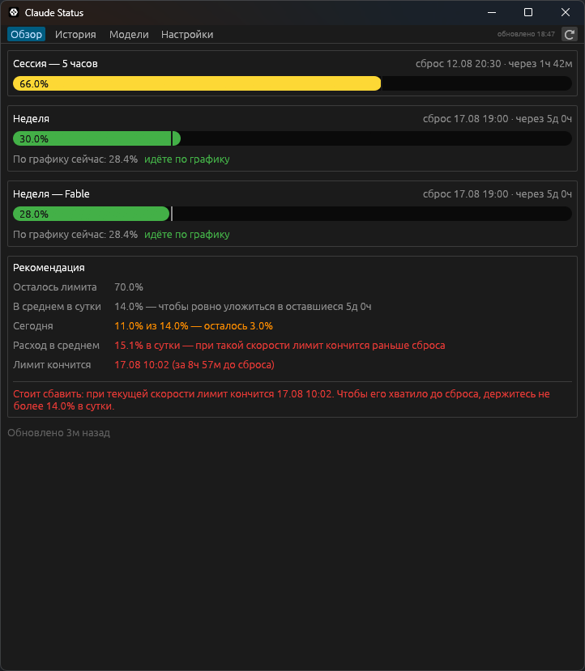
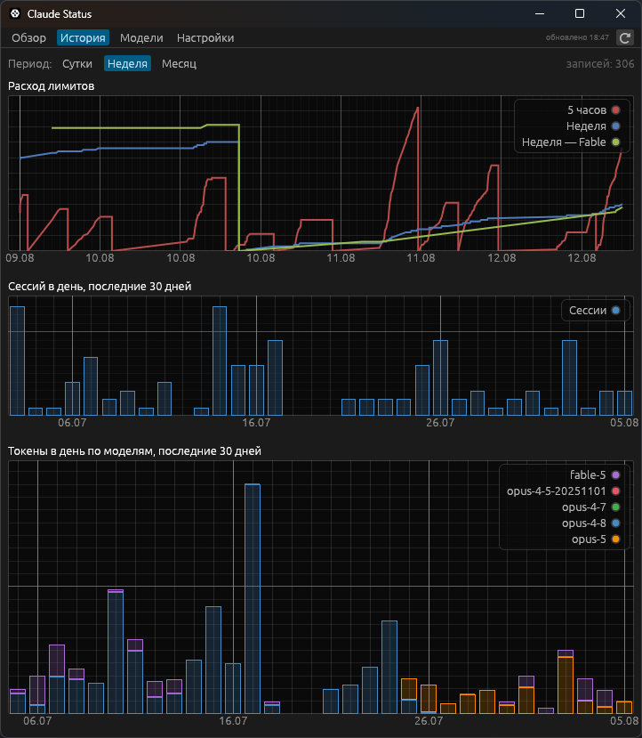
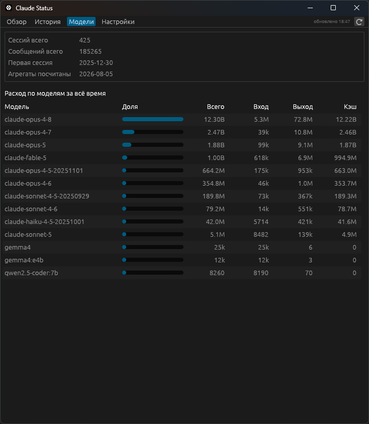
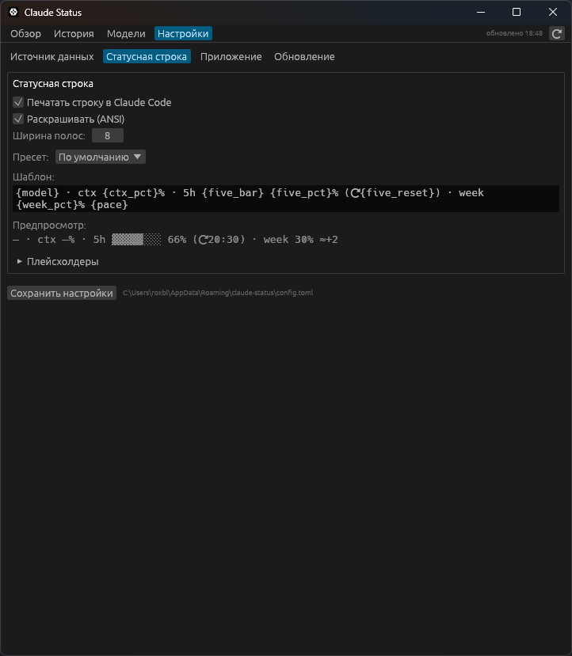

# claude-status

[](https://github.com/roxblnfk/claude-status/actions/workflows/ci.yml)
[](https://github.com/roxblnfk/action-vibe-index)
[](README.md)

Claude Code никак не сообщает, насколько быстро расходуются лимиты подписки, —
пока один из них не остановит работу. Эта программа за ними следит.

Иконка в трее с двумя кольцами — снаружи пятичасовая сессия, внутри норма на
сегодня из недельного лимита, — окно с историей и, если нужно, строка в статусной
панели самого Claude Code. Самое полезное — подсказка: сколько ещё можно
потратить сегодня, чтобы ровно уложиться в недельное окно, а не остаться без
лимита в четверг.

| Обзор | История |
|:--:|:--:|
|  |  |
| **Модели** | **Настройки** |
|  |  |

## Установка

Взять архив под свою платформу из
[релизов](https://github.com/roxblnfk/claude-status/releases), распаковать куда
угодно, запустить `claude-status` и нажать **«Прописать в Claude Code»** в
**«Настройки → Источник данных»**. После этого перезапустить сессии Claude Code.

Прописка правит один ключ в `~/.claude/settings.json`, снимая резервную копию, и
не трогает чужую статусную строку, пока ей это не разрешат.

На Linux иконке в трее нужны системные библиотеки:

```bash
sudo apt install libgtk-3-dev libayatana-appindicator3-dev libxdo-dev
```

## Что стоит знать

Статусная строка доходит только до Claude Code, запущенного из терминала: сессия
внутри редактора её не рисует. Когда она замолкает, лимиты запрашиваются
напрямую — для этого поднимается отдельный короткоживущий Claude Code, не чаще
чем раз в 15 минут. И интервал, и сам запрос настраиваются в **«Настройки →
Источник данных»**.

Куда ушли токены — по моделям, по проектам и сколько из этого потратили
субагенты — считается по логам сессий, которые пишет Claude Code: раз в сутки
само, кнопкой в **«Настройки → Источник данных»** или командой `claude-status
scan`. Считаются только целые сообщения, поэтому продолженная сессия не
раздувает итог, повторяя историю, которую она продолжает.

Период выбирается на вкладках «История» и «Модели» и листается стрелками: одним
и тем же движением смотрится прошлая неделя, позапрошлый месяц или всё сразу.

Шаблон статусной строки правится в окне: там же предпросмотр, готовые пресеты и
список плейсхолдеров.

Настройки, база и её резервные копии лежат в `%APPDATA%\claude-status` на
Windows, `~/.local/share/claude-status` на Linux и `~/Library/Application
Support/claude-status` на macOS. Переопределяется через `CLAUDE_STATUS_DIR`.

Язык интерфейса берётся из системы, переключается на английский или русский.

Всё, что делает окно, можно сделать и из консоли, если хочется автоматизации:
список команд — в `claude-status --help`.

## Сборка из исходников

```bash
cargo build --release
```

Бинарник появится в `target/release/` и может лежать где угодно.
